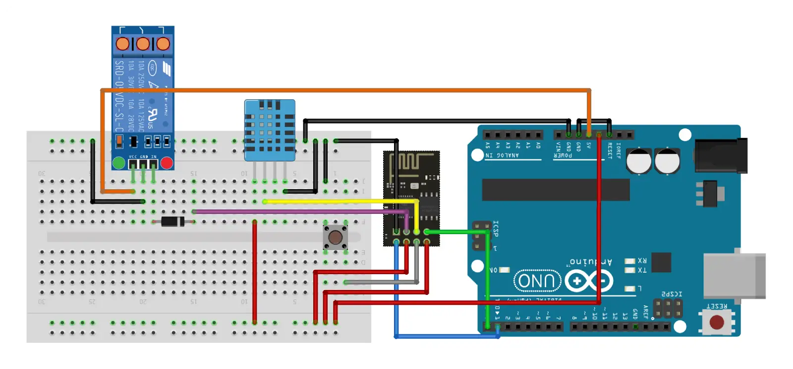

# ESP-01 Thermostat 🌡
A simple and cheap thermostat controlled by an esp8266 with a web interface.

## Requirements

**Hardware:**
* **ESP-01** or any other esp8266, esp32's might need some code changes
* **DHT11 sensor** or DHT22/AM2301/AM2302/AM2321  
* **Relay module** If using a low level trigger, a rectifying diode is needed to stop 3v3 from being detected as low. If you just use a relay, a transistor is needed to trigger it.
* **USB to TTL programmer** for flashing (im using an Arduino Uno)
* 3v3 and 5v Power supply
* Cables
* Button

**Software:**
* VSCode with platformio extension
* library adafruit/DHT sensor 
* library bblanchon/ArduinoJson
* library esphome/ESPAsyncWebServer-esphome

## Assembly

Follow the schematic to assemble and program the thermostat.

After flashing, the following are not needed:
* the button and the 2 cables connected to it (black and gray).
* the green and blue wires.
* the red wire between blue and gray.
* the arduino Uno but a replacement for 5v and 3v3 power is needed.

## Configure

### In config.h
* Set your Wi-Fi SSID and password.

### In main.cpp
* Confiure local IP, gateway and subnet.
* If using other sensor than DHT11, set DHTTYPE to the corresponding value.

## Flashing

> [!IMPORTANT]
> When flashing, the Yellow cable should be connected to GND instead of the data pin of the DHT sensor.  
> A push of the button is needed for the esp to enter the bootloader (If it stays "Connecting....._____" push it again).

Inside platformio:
* Go to **Project Tasks** -> **ESP-01** -> **General** and **Upload** the code
* Go to **Project Tasks** -> **ESP-01** -> **Platform** and upload the **Filesystem Image**.

After uploading the fileSystem image, an error might appear.

> A fatal error occurred: Timed out waiting for packet header

If it does, ignore it.

## Usage
By using the web interface, select a mode.
* In **fixed** mode, select **OFF**, **ON** or a **custom** target temperature. 
* In **schedule** mode, select **single**, **weekly** or **daily** depending on how custom schedules are configured.
  * **Single:** you set one schedule that will be repeated every day.
  * **Weekly:** allows you to have distinct schedules for weekdays and weekends.
  * **Daily:** offers a custom schedule for every day of the week.

> [!NOTE]
> each schedule consists of a list of start times, end times and target temperatures.

## Contributing
Contributions are welcome! Please open an issue or pull request.

## TODO
- [x] ~~Add schematic.~~
- [x] ~~Persist schedule on power loss.~~
- [x] ~~Add more config options to web interface.~~
- [ ] Restructure code into separate files.
- [ ] Backup confing before changing.
- [ ] Change config without reboot.
- [ ] Show available newtworks.
- [ ] Remember multiple networks.
- [ ] Create AP when no Wi-Fi SSID and password are provided connection fails or button press on boot.
- [ ] Add data logging.
- [ ] Show data graph on web interface.
- [ ] Improve file configuration.
- [ ] Improve README.md
- [ ] Go back to EspWebServer instead of ESPAsyncWebServer for lower memory usage.